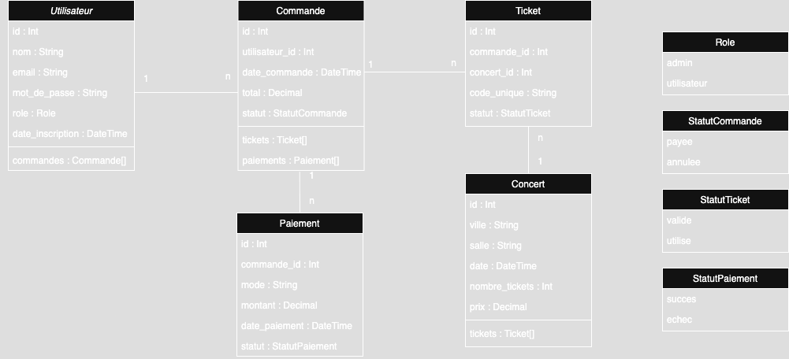

## 🎫 Site Web de Vente de Tickets – ABGYhuDJ

---

## 🎯 Objectif du projet

Développer un site web attrayant et accessible pour permettre aux fans du YouTuber fictif **ABGYhuDJ** d’acheter des tickets pour ses concerts.
Le site doit refléter les préférences visuelles du client (rouge) tout en offrant une expérience utilisateur fluide et sécurisée.

---

## 🏗️ Structure complète du projet

```
/frontend/
│
├── index.html                 # Page d'accueil
├── dates-tournee.html         # Page des dates de la tournée
├── reservation.html           # Formulaire de réservation et paiement
├── styles.css                 # Feuille de styles principale
├── custom.scss                # Styles personnalisés Bootstrap
├── js/
│   └── script.js              # Scripts d’interactivité (bouton retour haut, animations)
├── images/                    # Illustrations, photos et logo
│
/backend/
│
├── index.js                   # Point d’entrée serveur Node.js + Express
├── routes/
│   └── utilisateurs.js        # Routes liées aux utilisateurs (login, inscription)
│   └── reservations.js        # Routes pour gérer les réservations
├── controllers/               # Logique métier backend
├── models/                    # Modèles (Prisma pour BDD)
├── middleware/                # Middleware d’authentification, sessions, etc.
├── utils/                     # Utilitaires (logs, gestion des erreurs)
├── .env                       # Variables d’environnement (config MongoDB, secrets)
├── package.json               # Dépendances Node.js
├── prisma/
│   └── schema.prisma          # Schéma Prisma (BDD relationnelle)
│
README.md                      # Documentation du projet
```

---

## ⚙️ Stack et outils utilisés

### Frontend

* **HTML5 / CSS3 / SCSS**
* **JavaScript** (vanilla)
* **Bootstrap** (customisé via SCSS)
* **FontAwesome** (icônes)
* **Figma / Excalidraw** (maquettes, wireframes)

### Backend

* **Node.js** (runtime JavaScript côté serveur)
* **Express** (framework web minimaliste pour Node.js)
* **Prisma ORM** (gestion et manipulation de la base de données relationnelle)
* **MongoDB Atlas** (base de données NoSQL pour logs et statistiques)
* **dotenv** (gestion des variables d’environnement)
* **bcrypt** (hachage sécurisé des mots de passe)
* **express-session** (gestion des sessions utilisateurs)
* **Heroku** (déploiement de l’application backend)

### Outils divers

* **Visual Studio Code**
* **Git / GitHub** (versioning)
* **Lighthouse, Wave** (tests accessibilité et performance)
* **Responsinator** (tests responsive)
* **cssminifier, TinyPNG** (optimisation des ressources)

---

## ⚙️ Procédure d’installation et configuration

### 1. Cloner le dépôt

```bash
git clone https://github.com/ton-utilisateur/ton-projet.git
cd ton-projet
```

### 2. Installer les dépendances backend

```bash
cd backend
npm install
```

### 3. Configurer les variables d’environnement

Créer un fichier `.env` dans le dossier `/backend` avec les variables suivantes :

```
MONGODB_URL="mongodb+srv://<user>:<password>@cluster0.mongodb.net/logs?retryWrites=true&w=majority"
MONGODB_DB_NAME="logs"
PORT=3000
SESSION_SECRET="une_phrase_secrete_pour_les_sessions"
JWT_SECRET="une_autre_phrase_secrete_pour_les_tokens"
```

> Adapte bien les valeurs à ton compte MongoDB Atlas et à tes préférences.

### 4. Lancer le serveur backend

```bash
npm start
```

Le serveur sera accessible à l’adresse : `http://localhost:3000`

### 5. Lancer le frontend

Ouvre simplement les fichiers HTML dans un navigateur ou configure un serveur local si besoin.

---

## 🧩 Fonctionnalités

* Interface frontend responsive et accessible
* Formulaire de réservation avec validation
* Authentification sécurisée (inscription, connexion, déconnexion)
* Enregistrement des réservations dans une base relationnelle via Prisma
* Logs des actions et visites enregistrés dans MongoDB
* Sessions utilisateurs gérées via express-session
* JWT pour sécuriser certaines routes backend

---

## 🔐 Sécurité & Accessibilité

* Mots de passe hachés avec bcrypt
* Protection des routes sensibles via JWT et sessions
* Bonne gestion des erreurs côté serveur
* Accessibilité respectée sur le frontend (contraste, navigation clavier)
* Minimisation des fichiers CSS et optimisation des images

---

## ✅ Tests

* Tests manuels d’accessibilité avec Lighthouse et Wave
* Tests responsive sur différents navigateurs et appareils
* Validation des formulaires côté client et serveur
* Test des API backend avec Postman

---

## 📈 Évolutions futures

* Ajout de la gestion des paiements sécurisés
* Refactor du frontend en React ou Vue.js
* Ajout d’un dashboard admin pour la gestion des réservations
* Tests automatisés backend avec Jest / Supertest
* Déploiement complet (frontend + backend) sur plateforme cloud

---

## 📁 Livrables

### 📁 Code source du serveur et de la base de données

Lien vers le repo :
[https://github.com/GillesCob/ABGYhuDJ-backend](https://github.com/GillesCob/ABGYhuDJ-backend)

### 🗃️ Fichiers SQL de création de la base

Le fichier SQL de création de la base relationnelle MySQL a été généré automatiquement par Prisma via la commande `npx prisma migrate dev`.

➡️ Vous pouvez le retrouver ici :
[`prisma/migrations/20250712075133_init/migration.sql`](./prisma/migrations/20250712075133_init/migration.sql)

### 🧾 Modèle NoSQL – MongoDB

L’application utilise MongoDB pour enregistrer les **logs d’activité utilisateur**, notamment :

* Connexions
* Déconnexions
* Achats de billets
* Visites de pages (à venir)

#### 📂 Collection : `logs`

Chaque document de la collection `logs` a la structure suivante :

```json
{
  "_id": "ObjectId",
  "userId": "string|null",      // Identifiant de l'utilisateur (null si non connecté)
  "action": "string",           // Type d'action : "connexion", "deconnexion", "achat"
  "timestamp": "Date"           // Date et heure de l'action
}
```

---

## 📄 Documentation technique complète

### 🧱 Architecture du projet

Le projet suit une architecture **MVC (Modèle - Vue - Contrôleur)**, adaptée à une application Express avec un moteur de vues EJS côté frontend, et une base de données hybride SQL/NoSQL.

#### 🧩 Modèle (Model)

* Géré via **Prisma** pour la base **relationnelle MySQL** (tables : utilisateurs, concerts, tickets, commandes, paiements).
* Fichiers liés : `prisma/schema.prisma`, migrations dans `prisma/migrations`
* La base **NoSQL MongoDB** est utilisée pour stocker les **logs (connexions, déconnexions, achats)**.
* Connexion dans `mongo.js`
* Structure dynamique (voir section "🧾 Modèle NoSQL – MongoDB")

#### 🎮 Contrôleur (Controller)

* La logique métier (validation, traitement des requêtes) est placée dans des **middlewares** et des fonctions dans les routes.
* Dossier : `middleware/` pour la validation, authentification, etc.
* Dossier : `routes/` pour les routes Express organisées par ressources (utilisateurs, réservations, etc.)

#### 🧭 Vue (View)

* Le **frontend** utilise **EJS** comme moteur de template pour générer dynamiquement les pages côté serveur.
* Dossier : `frontend/pages/` pour les vues principales (`connexion.ejs`, etc.)
* `partials/` contient les éléments réutilisables (ex : `header.ejs`)
* `styles/`, `js/`, `images/` pour le style et les scripts

#### 🧰 Autres composants

* `utils/` : fonctions utilitaires, dont `logActivity.js` pour enregistrer les logs d’activité dans MongoDB (connexion, achat, déconnexion)
* `generated/prisma/` : client Prisma généré automatiquement
* `index.js` : point d’entrée principal de l’application backend (serveur Express)
* `.env` : variables d’environnement (URL MongoDB, DB SQL, etc.)

#### 🔄 Communication

* Les requêtes HTTP sont envoyées depuis le frontend vers les routes Express côté backend.
* Les vues sont générées via EJS ou manipulées côté client avec JS.
* Le backend interagit avec :

  * La base SQL via Prisma
  * MongoDB via le client Mongo natif

---

### Diagramme de classe



---

## 👨‍🎓 Auteur

**Gilles COBIGO**
Ce projet a été réalisé dans le cadre d’un exercice pédagogique.
Formation Développeur Web et Web Mobile, Live Campus 2025

---